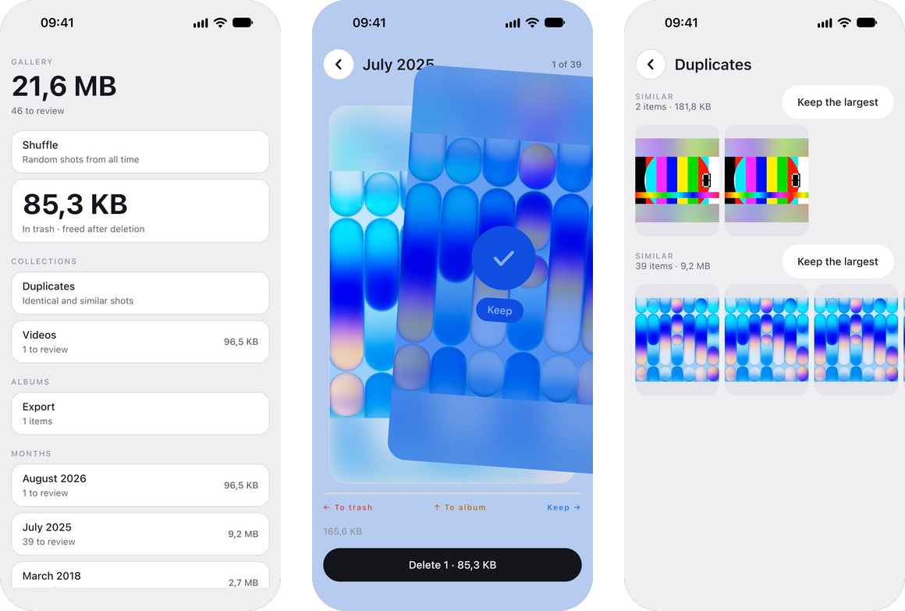
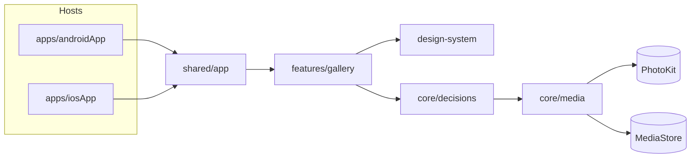

<p align="center">
  
</p>

<h1 align="center">Swishy</h1>

<p align="center">
  Clean up your photo library one swipe at a time. Free, no ads, and it never goes online.
</p>

<p align="center">
  
  
  
  
  
</p>

<p align="center">
  
</p>

## What it does

A photo library grows for years, and sorting it feels endless. Swishy shows one photo or
video at a time and asks for one decision.

- **Swipe right to keep, left to trash, up to set aside in an album.** The screen, the photo,
  an icon and a word take on the direction while you drag, so you always know what the
  release will do.
- **Month by month, or all mixed.** Every month shows what is left to sort and how much it
  weighs. Subsets gather screenshots, videos, Live Photos and favorites.
- **Duplicates and near-duplicates.** Perceptual hashes find identical shots and bursts
  across the whole library, on the device.
- **Nothing is deleted by a swipe.** Marked photos wait in the trash screen and leave in one
  batch with a single system confirmation; the app says plainly that space comes back once
  the system's Recently Deleted is emptied.
- **Decisions are remembered.** A kept photo never comes back; the last decision can be undone.
- **Private by construction.** No account, no analytics, no network permission at all.
- English and Russian throughout, light and dark themes, Reduce Motion respected.

## Platforms

| App | Platform | Notes |
| --- | --- | --- |
| iPhone | iOS 16 and later | Live Photos and videos play while the card is held; albums through PhotoKit |
| Android | Android 11 and later | Batch delete through the system trash; no albums (Android has folders) |

## How it is built

The whole UI is shared Compose Multiplatform code. Only the photo library, video and Live Photo
playback are platform code behind `expect`/`actual`.



- **`shared/core/media`** reads the library once per process, draws photos as bitmaps so they
  move with the card, computes perceptual hashes and talks to albums.
- **`shared/core/decisions`** keeps keep, trash and move decisions in Room and builds the deck.
- **`shared/design-system`** holds the tokens, fonts and components, including the swipe deck.
- **`shared/features/gallery`** holds every screen; navigation is a Decompose stack.

More in [docs/ARCHITECTURE.md](docs/ARCHITECTURE.md) and [docs/DESIGN.md](docs/DESIGN.md).

## Repository layout

```
apps/
  androidApp/   Android host
  iosApp/       iOS host and project.yml for XcodeGen
shared/
  app/          composition root and the SwishyKit framework for iOS
  features/     screens
  design-system/
  core/         media, decisions, strings
build-logic/    Gradle convention plugins
config/         version and detekt settings
docs/           architecture, build, conventions, design, git
scripts/        project checks and git hooks
```

## Building

Requirements: JDK 17, Android SDK 37, Xcode 26 and [XcodeGen](https://github.com/yonaskolb/XcodeGen).

```bash
git config core.hooksPath scripts/git-hooks
```

Android:

```bash
./gradlew :apps:androidApp:assembleDebug
```

iOS. Generate the Xcode project, which is not committed, then run the `Swishy` scheme; a build
phase builds the shared framework:

```bash
cd apps/iosApp && xcodegen generate && open Swishy.xcodeproj
```

To run on a device, copy `apps/iosApp/Signing.xcconfig.example` to
`apps/iosApp/Signing.xcconfig` and set your team. More in [docs/BUILD.md](docs/BUILD.md).

## Contributing

Work goes through issues and pull requests; the flow, branch names and commit format are in
[docs/GIT.md](docs/GIT.md). Before a commit:

```bash
./scripts/check-conventions.sh
```

## License

Copyright (c) 2026 Disspear574. All rights reserved. The source is available for reference
only; see [LICENSE](LICENSE).
