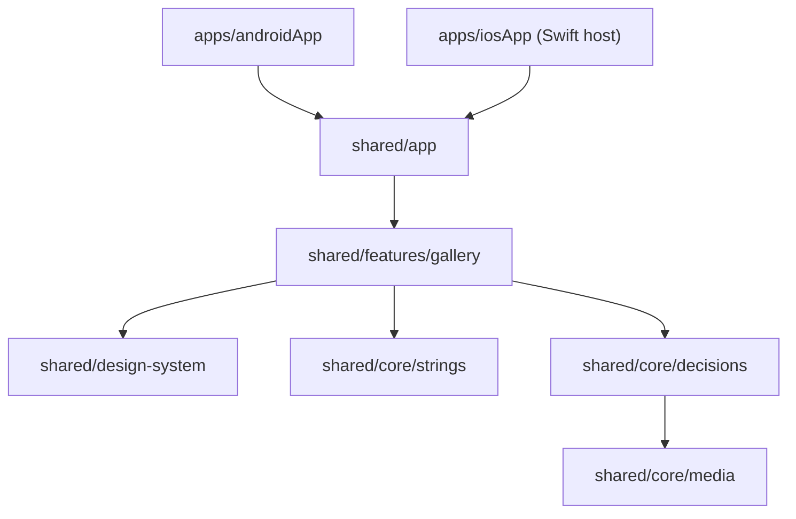

# Architecture

Swishy is one Compose Multiplatform app for Android and iOS. Everything on screen is shared
Kotlin; only access to the photo library, video playback and Live Photo playback are platform
code behind `expect`/`actual`.

## Modules

| Module | Holds |
| --- | --- |
| `apps/androidApp` | Android entry point, permissions, the host for system dialogs (trash request) |
| `apps/iosApp` | Swift entry point and `Info.plist`; the Xcode project is generated from `project.yml` |
| `shared/app` | Composition root: stores, navigation root, the `SwishyKit` framework for iOS |
| `shared/features/gallery` | Every screen: months, deck, trash, duplicates, albums, settings |
| `shared/design-system` | Tokens, fonts, components: swipe deck, sheets, buttons, progress track |
| `shared/core/strings` | Compose resources only: English in `values-en/`, Russian in `values/` |
| `shared/core/media` | Photo library on both platforms, thumbnails, perceptual hashes, albums |
| `shared/core/decisions` | Keep, trash and move decisions, the deck model, Room storage |

## Photo library

`MediaLibrary` is the one gate to the platform library: a snapshot of every asset, sizes on
demand, batch delete through the system trash. `AlbumLibrary` adds user albums; on Android it
reports `supportsAlbums = false` and the swipe up is not offered.

| Operation | iOS | Android |
| --- | --- | --- |
| Read the library | `PHAsset.fetchAssets` | `MediaStore` Files table |
| Show a photo | `PHCachingImageManager` → bitmap drawn by Compose | `ImageDecoder` |
| Play video | `AVPlayerViewController` while the card is held | Media3 `PlayerView` |
| Delete | `PHPhotoLibrary.performChanges` | `MediaStore.createTrashRequest` |
| Albums | `PHAssetCollection` | not supported |

The library is read once per process and filtered in memory: months, subsets (screenshots,
videos, Live Photos, favorites) and the shuffled deck are views over the same snapshot.

## Decisions

Every asset gets at most one decision: `KEPT`, `TRASHED` or `MOVED`. Decisions live in Room
with an in-memory cache; the deck waits for the write before it shows the next card, so a
decision survives the process being killed right after a swipe. Nothing is deleted until the
trash screen sends one batch to the system.

## Duplicates

`PerceptualHash` computes a dHash and a pHash from a 32×32 grayscale thumbnail.
`DuplicateGrouping` puts equal hashes into "identical" groups and joins hashes within
distance 8 (dHash) and 10 (pHash) into "similar" groups, using banding and union-find instead
of comparing every pair. Hashes are stored in Room and computed only for new assets.

## Navigation

Decompose child stack in `GalleryComponent`: months, deck (for a month, a subset, an album or
the shuffled library), trash, duplicates, settings.
